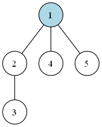
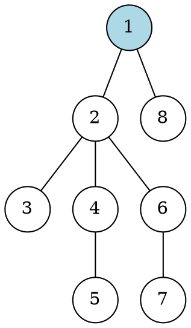
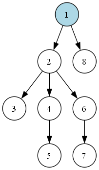
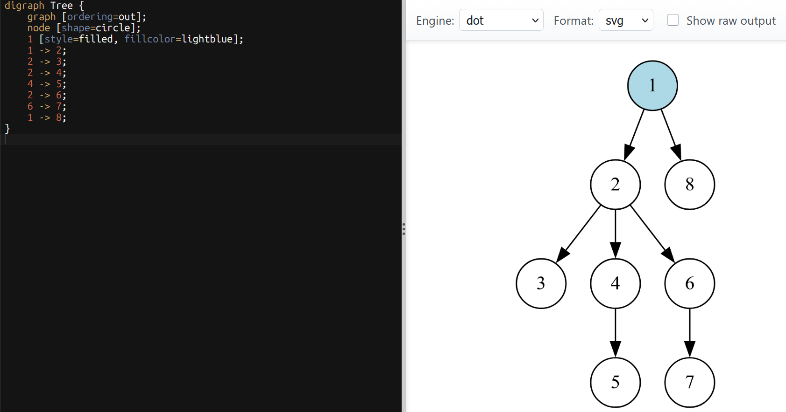
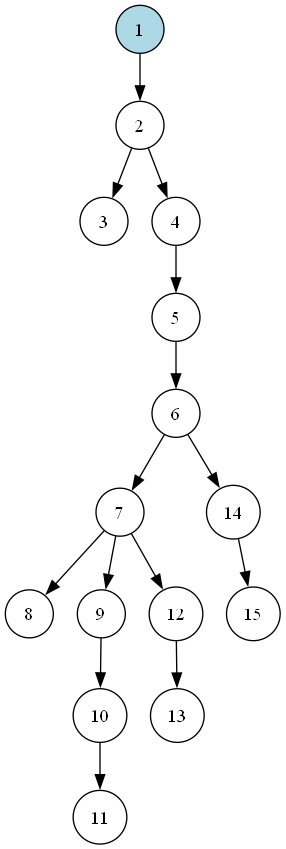
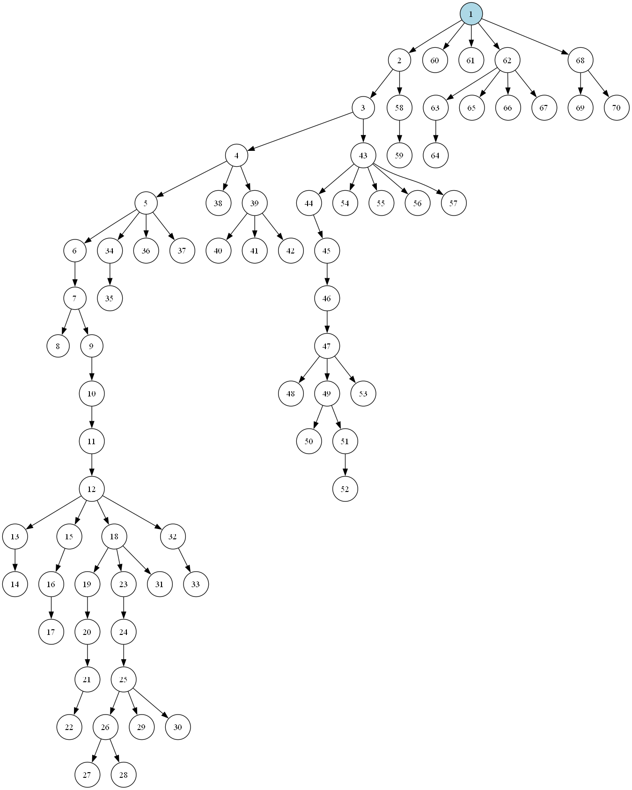
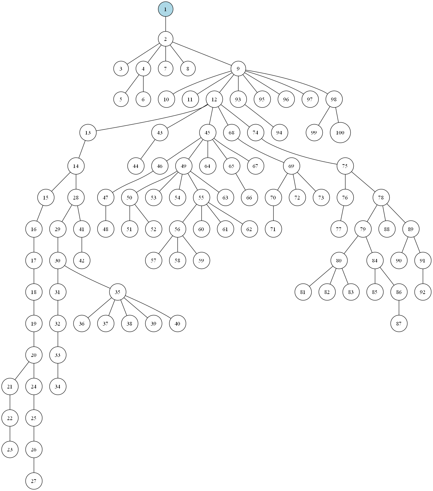

# Восстановление дерева по двоичному коду

Выполнил: Садилов Егор, ПМИ-2 

Программа восстанавливает дерево по двоичной последовательности, сохраняет полученный граф в формате DOT и 
с помощью Graphviz создаёт его изображение в PNG.



## Формат двоичного кода

Для описания дерева используются два символа:

- `0` - создать новую вершину, соединить её с текущей и сделать новую вершину - текущей;
- `1` - вернуться из текущей вершины к её родителю.

Чтобы последовательность была корректной, количество нулей и единиц в ней должно совпадать. 
Кроме того, в любом префиксе этой последовательности количество единиц не должно превышать количество нулей.

Например, последовательность `00110101` задаёт рёбра `1-2`, `2-3`, `1-4` и `1-5`.

## Запуск

Для запуска нужен JDK 25. Graphviz нужен только для PNG: если команда `dot` недоступна в `PATH`, 
программа всё равно сохранит DOT-файл.

```powershell
.\gradlew.bat run
```

Если путь к входному файлу не указан, программа использует файл `examples/small.txt`.
Чтобы обработать другой файл, его путь можно передать через аргументы:

```powershell
.\gradlew.bat run --args="examples/random-8.txt"
```

Результаты сохраняются в папку `results`: 
- DOT-файлы в `results/dot`;
- PNG-изщбражения в `results/png`.

Примеры входных файлов лежат в `examples`.

## Принцип работы

Программа считывает входной файл по частям и обрабатывает каждый символ последовательности только один раз.
В начале в стеке находится корневая вершина с номером 1. Сам стек хранит путь от корня дерева до текущей вершины.
При чтении `0` программа создаёт новую вершину, соединяет её с текущей вершиной и добавляет в стек. Новая вершина становится текущей.
При чтении `1` текущая вершина удаляется из стека, после чего программа возвращается к её родителю.
Если в стеке находится только корневая вершина, встретившийся символ `1` означает, что входная последовательность некорректна.
После обработки всей последовательности в стеке должна остаться только корневая вершина.
Если это не так, последовательность считается некорректной.

Полученные рёбра записываются в DOT-файл, после чего Graphviz, если он есть, строит по нему изображение дерева в формате PNG.

Временная сложность: `O(L)`, где `L` - количество символов входного файла.

## Пример работы

Для файла `examples/random-8.txt` используется входная последовательность:

`00100110011101`

Вывод программы:

```text
vertices: 8, edges: 7
DOT: results/dot/random-8.dot
PNG: results/png/random-8.png
```

Содержимое полученного файла `results/dot/random-8.dot`:



Полученное изображение дерева:



Визуализация DOT-файла:



## Другие примеры полученных графов

### Дерево из 15 вершин



### Дерево из 70 вершин



### Дерево из 100 вершин


