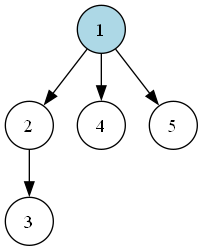

# Восстановление дерева по двоичному коду

Программа восстанавливает корневое дерево, экспортирует его в DOT и сразу создаёт PNG через Graphviz.



## Двоичный код дерева

- `0` — перейти от текущей вершины по новому ребру к новой вершине;
- `1` — вернуться к родителю;
- пробелы и переносы строк игнорируются;
- вершины нумеруются с `1` в порядке появления;
- пустой код задаёт дерево из одной вершины.

Корректный код содержит поровну нулей и единиц, причём ни один его префикс не содержит больше единиц, чем нулей.

Например, код `00110101` задаёт рёбра `1 → 2`, `2 → 3`, `1 → 4`, `1 → 5`.

## Запуск

Требуются JDK 25 и команда `dot` из [Graphviz](https://graphviz.org/download/) в `PATH`.

```powershell
.\gradlew.bat run
```

Без аргумента программа использует `small.txt` из папки `examples`. Для другого файла можно передать любой относительный или абсолютный путь:

```powershell
.\gradlew.bat run --args="<путь-к-файлу.txt>"
```

В папке `results` создаются файлы `dot/<имя>.dot` и `png/<имя>.png`.

## Алгоритм

Файл читается один раз буферизованными блоками. В начале создаётся корневая вершина с номером `1`, и её номер помещается в стек. Стек хранит путь от корня до текущей вершины.

При чтении `0` программа создаёт новую вершину, добавляет ребро от текущей вершины к новой и помещает её номер в стек. При чтении `1` верхняя вершина удаляется из стека, поэтому текущей снова становится её родитель. Если стек уже содержит только корень, символ `1` считается ошибкой.

После чтения всего кода в стеке должен остаться только корень. Полученный список рёбер записывается в DOT-файл, после чего Graphviz строит по нему PNG.

- время: `O(L)`, где `L` — размер входного файла;
- память: `O(n)` для списка рёбер и до `O(h)` для стека, где `n` — количество вершин, а `h` — высота дерева.
